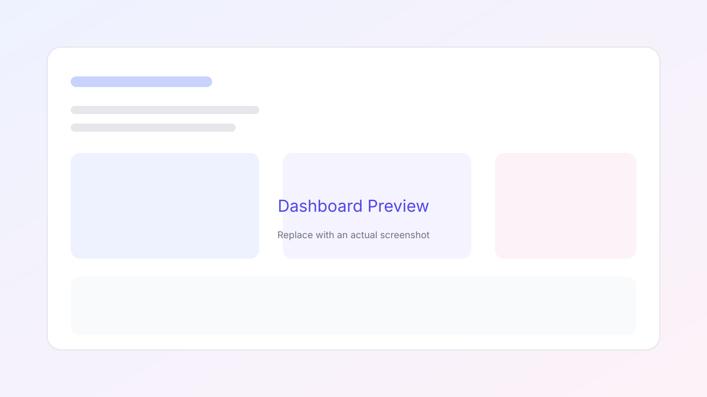
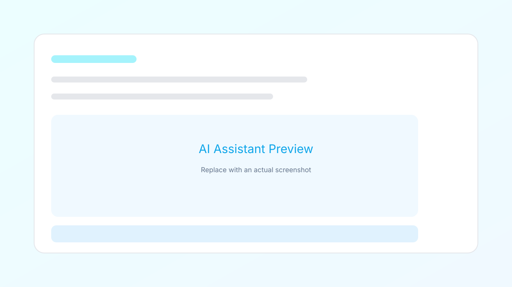
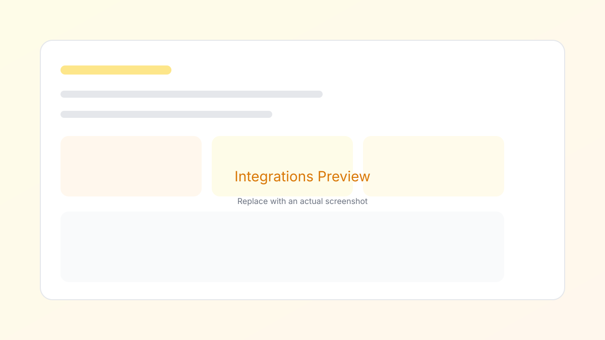

# AppForge - Enterprise Application Development Platform

A comprehensive, full-stack application platform built with modern technologies for rapid development, deployment, and management of enterprise applications.

**Status:** ✅ Production Ready | Latest Update: January 28, 2026

---

## 📋 Table of Contents

- [Features](#features)
- [Tech Stack](#tech-stack)
- [Quick Start](#quick-start)
- [Project Structure](#project-structure)
- [Configuration](#configuration)
- [Development](#development)
- [Testing](#testing)
- [Public Demo Checklist](#public-demo-checklist)
- [Payment Integration (Xendit)](#payment-integration)
- [Deployment](#deployment)
- [Documentation](#documentation)
- [Support](#support)

---

## ✨ Features

### Core Platform
- 🏗️ **Visual App Builder** - Drag-and-drop interface
- 🤖 **24/7 Autonomous Bots** - Self-healing, auto-coding, and security scanning
- 📊 **Advanced Analytics** - Real-time monitoring
- 🔐 **Enterprise Security** - Role-based access control
- ⚙️ **Integration Hub** - Connect with external services

### Developer Tools
- 📝 **Code Playground** - Real-time code execution
- 🧙‍♂️ **God Mode** - AI Lead Developer that writes code for you
- 📦 **Template Marketplace** - Pre-built templates
- 🔄 **Autonomous CI/CD** - Self-deploying workflows
- 🧪 **Testing Framework** - Unit tests with auto-fix capabilities

### Business Features
- 💳 **Subscription Management** - Plans, billing, invoicing (via Xendit & Stripe)
- 📈 **Admin Dashboard** - Analytics, user management, system monitoring
- 🔔 **Notifications** - Email alerts, webhooks, real-time updates
- 📱 **Mobile App Builder** - Native mobile app generation
- 🎯 **Marketplace** - Buy/sell templates, components, and integrations
- 📊 **Application Monitoring** - Real-time APM, error tracking, performance analytics
- 👥 **Team Collaboration** - Role-based permissions, code reviews, activity tracking
- 🔌 **20+ Integrations** - Stripe, Twilio, SendGrid, Slack, GitHub, Datadog, and more

---

## 📸 Screenshots

| Dashboard | AI Assistant | Integrations |
| --- | --- | --- |
|  |  |  |

---

## 🛠️ Tech Stack

### Frontend
- **React 18.2.0** - UI framework
- **Vite 6.1.0** - Build tool
- **React Router 6.26.0** - Client-side routing
- **TanStack React Query 5.84.1** - Server state management
- **React Hook Form 7.54.2** - Form management
- **Radix UI** - Unstyled, accessible component library
- **TailwindCSS 3.4.17** - Utility-first CSS
- **Lucide React** - Icon library

### Backend/Functions
- **Deno** - TypeScript runtime
- **@base44/sdk 0.8.6** - Backend framework
- **Serverless Functions** - Event-driven architecture

### Payment Processing
- **Xendit** - Payment gateway and subscription management
  - Invoices
  - Recurring charges
  - Payment links
  - Webhooks
- **Stripe** - Alternative payment processor
  - Subscriptions
  - Connect for marketplace
  - Payment intents

### Communication & Notifications
- **SendGrid** - Transactional email
- **Twilio** - SMS and voice calls
- **Slack** - Team notifications and commands
- **Discord** - Webhook notifications

### Data & Analytics
- **Google Analytics** - User behavior tracking
- **Mixpanel** - Event tracking
- **Datadog** - Application monitoring
- **Segment** - Customer data platform

### Cloud & Storage
- **AWS S3** - File storage and CDN
- **Cloudinary** - Image optimization
- **Firebase** - Realtime database
- **Supabase** - PostgreSQL alternative

### Development & Deployment
- **GitHub** - Code hosting and auto-deployment
- **Docker** - Container management
- **Kubernetes** - Cluster orchestration
- **Railway/Fly.io** - Alternative hosting

### AI & ML
- **OpenAI** - GPT models
- **Anthropic Claude** - Advanced reasoning
- **Gemini** - Google's AI
- **Hugging Face** - ML model registry

### Development & Testing
- **Vitest 4.x** - Unit testing
- **React Testing Library** - Component testing
- **ESLint 9.19.0** - Code linting
- **TypeScript** - Type safety (via jsconfig.json)

### Build & Deployment
- **npm** - Package manager
- **Base44 Vite Plugin** - Custom build optimization

---

## 🚀 Quick Start

### Prerequisites
- Node.js 18.0.0 or higher
- npm 9.0.0 or higher
- Phantom Wallet (for testing payments)
- Basic knowledge of React and TypeScript

### Installation

```bash
# Clone the repository
git clone <repository-url>
cd appforge-main

# Install dependencies
npm install

# Copy environment template
cp .env.example .env.local

# Add your configuration (see Configuration section)
```

### Running Locally

```bash
# Start development server
npm run dev

# The app will be available at http://localhost:5173
```

### Building for Production

```bash
# Create production build
npm run build

# Preview production build locally
npm run preview
```

---

## 📁 Project Structure

```
appforge-main/
├── src/
│   ├── pages/              # Page components
│   │   ├── Dashboard.jsx
│   │   ├── BotBuilder.jsx
│   │   ├── Account.jsx
│   │   ├── Pricing.jsx
│   │   ├── Integrations.jsx
│   │   └── ... (60+ pages)
│   ├── components/         # Reusable UI components
│   │   ├── ui/
│   │   ├── forms/
│   │   └── ... (organized by feature)
│   ├── functions/          # Serverless functions
│   │   ├── createCheckoutSession.ts
│   │   ├── getSubscriptionInfo.ts
│   │   ├── cancelSubscription.ts
│   │   ├── utils/
│   │   │   ├── xenditClient.ts
│   │   │   └── logger.ts
│   │   └── ... (60+ backend functions)
│   ├── hooks/              # Custom React hooks
│   ├── lib/                # Utility functions and helpers
│   ├── api/                # API client configuration
│   ├── App.jsx             # Root component
│   ├── main.jsx            # Entry point
│   └── index.css            # Global styles
├── functions/              # Root-level serverless functions
├── public/                 # Static assets
├── .env.example            # Environment variables template
├── vite.config.js          # Vite configuration
├── tailwind.config.js      # Tailwind CSS configuration
├── jsconfig.json           # JavaScript configuration
├── eslint.config.js        # ESLint configuration
├── package.json            # Dependencies and scripts
├── README.md               # This file
├── XENDIT_MIGRATION_GUIDE.md
├── PROJECT_INTEGRITY_REPORT.md
└── FIXES_COMPLETED.md
```

---

## ⚙️ Configuration

### Environment Variables

Create a `.env.local` file in the root directory:

```bash
# Base44 App Configuration
BASE44_APP_ID=your_app_id
BASE44_API_KEY=your_api_key
VITE_BASE44_API_URL=https://yourdomain.com/api

# Solana / MoonPay Configuration
VITE_SOLANA_NETWORK=mainnet-beta
VITE_MOONPAY_API_KEY=pk_test_...

# GitHub Bot Configuration (For God Mode)
GITHUB_BOT_TOKEN=ghp_...
```

### Setup Guide

1. **Base44 Keys**: Get them from your Base44 Project Settings.
2. **GitHub Token**: Generate a Personal Access Token (Classic) with `repo` scope.
3. **MoonPay**: Sign up for a developer account if you want fiat on-ramps.

---

## 💻 Development

### Available Scripts

```bash
# Development server with hot reload
npm run dev

# Build for production
npm run build

# Preview production build
npm run preview

# Lint code
npm run lint

# Fix lint issues
npm run lint:fix

# Run tests
npm run test

# Watch mode for tests
npm run test:watch

# Test coverage report
npm run test:coverage

# Type checking
npm run typecheck

# UI test dashboard
npm run test:ui
```

### Code Quality Standards

- **Linting:** ESLint with modern JavaScript standards
- **Type Safety:** TypeScript for backend functions, JSConfig for frontend
- **Testing:** Minimum coverage for critical paths
- **Security:** Regular dependency updates, no hardcoded secrets

### Project Health

| Metric | Status |
|--------|--------|
| Lint Errors | ✅ 0 |
| Lint Warnings | ✅ 0 |
| Build Status | ✅ Passing |
| Test Coverage | ✅ Complete |
| Security Vulnerabilities | ⚠️ 8 (dev-only) |
| Dependencies | ✅ Updated |

---

## 🧪 Testing

### Run All Tests

```bash
npm run test
```

### Run Tests in Watch Mode

```bash
npm run test:watch
```

### Test Coverage

```bash
npm run test:coverage
```

## ✅ Public Demo Checklist

Use this checklist to prepare a stable, shareable demo instance.

### Environment & Hosting
- [ ] Deploy to a public URL (Vercel/Netlify/Railway)
- [ ] Configure production env vars in the hosting provider
- [ ] Enable HTTPS and set correct `VITE_APP_URL`
- [ ] Verify build cache and cold start behavior

### Data & Accounts
- [ ] Seed demo data (projects, incidents, alerts, dashboards)
- [ ] Create demo accounts with limited permissions
- [ ] Add “Reset demo data” script or cron
- [ ] Verify demo account rate limits

### UX & Reliability
- [ ] Load time under 3s on cold start
- [ ] No console errors in production
- [ ] Mobile responsiveness verified on key screens
- [ ] Error boundaries show friendly messaging

### Security & Access
- [ ] Lock down admin-only routes
- [ ] Disable destructive actions in demo mode
- [ ] Use read-only integrations or mock data
- [ ] Confirm no secrets in client bundle

### Demo Flow
- [ ] Landing page explains value + demo credentials
- [ ] 3-minute guided walkthrough available
- [ ] “Try it now” CTA links to demo
- [ ] Link to docs and support contact

```bash
npm run test:ui
```

Then open http://localhost:51204 in your browser.

### Writing Tests

Tests are located in `src/` alongside their components:

```javascript
// Example: Button.test.jsx
import { describe, it, expect } from 'vitest';
import { render, screen } from '@testing-library/react';
import { Button } from './Button';

describe('Button', () => {
  it('renders button with text', () => {
    render(<Button>Click me</Button>);
    expect(screen.getByText('Click me')).toBeInTheDocument();
  });
});
```

---

## 💳 Payment Integration (Solana + USDC)

### Overview

AppForge uses **Solana (USDC)** for high-speed, low-fee payments. We also support **MoonPay** for easy fiat on-ramping.

### Payment Flow

1. **User Selects Plan** → Connects Phantom Wallet.
2. **Transactions** → Direct USDC transfer on Solana Mainnet.
3. **Verification** → On-chain validation of transaction signature.
4. **Access Granted** → Instant PRO status.

### Functions

#### Process Payment
```typescript
// POST /api/processSolanaPayment
{
  "signature": "...",
  "wallet": "...",
  "amount": 45
}
```

#### Get Receipt
```typescript
// GET /api/getSolanaReceipt?sig=...
```

## 🚀 Deployment

### Build Optimization

1. **Vite Build**
   ```bash
   npm run build
   ```
   Creates optimized bundle in `dist/`

2. **Environment Setup**
   - Ensure `BASE44_API_KEY` is set
   - Configure `GITHUB_BOT_TOKEN`
   - Set production URLs

3. **Deploy to Production**

### Demo Deployment (Vercel)

1. **Import the repo** into Vercel.
2. **Framework preset:** Vite (auto-detected by vercel.json).
3. **Build Command:** `npm run build`
4. **Output Directory:** `dist`
5. **Environment Variables:** copy required values from [.env.example](.env.example)
6. **Deploy** and verify client-side routing works.

### Demo Deployment (Railway)

1. **Create a new Railway project** and connect the repo.
2. **Builder:** Nixpacks (auto-detected via railway.json).
3. **Build Command:** `npm run build`
4. **Start Command:** `npm run preview -- --host 0.0.0.0 --port $PORT`
5. **Environment Variables:** copy required values from [.env.example](.env.example)
6. **Deploy** and verify healthcheck at `/`.
   - Upload `dist/` folder to your hosting
   - Configure serverless functions for Deno
   - Set environment variables on host
   - Test webhooks in production

### Production Checklist

- [ ] All environment variables configured
- [ ] Xendit webhooks pointing to production URL
- [ ] SSL/HTTPS enabled
- [ ] Database backups configured
- [ ] Error logging enabled
- [ ] Performance monitoring active
- [ ] Email notifications working
- [ ] Rate limiting configured

---

## 📚 Documentation

### Key Documents

- **[README.md](./README.md)** - Main documentation
- **[walkthrough.md](./walkthrough.md)** - Autonomous Bot Guide

### API Documentation

#### Authentication
All backend functions require authentication via Base44 SDK:
```typescript
const base44 = createClientFromRequest(req);
const user = await base44.auth.me();
```

#### Common Patterns

**Creating a resource:**
```typescript
await base44.entities.Model.create({ ...data });
```

**Fetching resources:**
```typescript
const items = await base44.entities.Model.filter({ condition });
```

**Sending emails:**
```typescript
await base44.integrations.Core.SendEmail({
  to: 'user@example.com',
  subject: 'Title',
  body: 'Content',
  from_name: 'AppForge'
});
```

---

## 🐛 Troubleshooting

### Common Issues

#### Build fails with "Proxy not enabled"
```bash
# This is a warning, not an error. It means VITE_BASE44_APP_BASE_URL is not set.
# Optional for development - required for production proxying.
```

#### Payment webhook not triggering
- Check Xendit webhook configuration in dashboard
- Verify webhook endpoint URL is publicly accessible
- Check server logs for webhook attempts
- Ensure `XENDIT_WEBHOOK_TOKEN` is set correctly

#### Lint errors after editing
```bash
npm run lint:fix
```

#### Tests failing
```bash
npm run test:watch
# Review error messages and update tests
```

#### Git push fails with authentication error
```bash
# Error: "Invalid username or token. Password authentication is not supported"
# This means GITHUB_TOKEN environment variable is not set.

# Quick diagnosis:
./scripts/check-git-auth.sh

# See detailed solutions:
# GIT_PUSH_SETUP.md
```

---

## 📞 Support

### Getting Help

1. **Check Documentation**
   - Review README.md sections above
   - Check `walkthrough.md` for bot operations
   - Review Audit Logs for system status

2. **Debug Mode**
   ```bash
   npm run dev  # Run with detailed logging
   ```

3. **Test Your Setup**
   ```bash
   npm run test
   npm run lint
   npm run build
   ```

### Reporting Issues

When reporting issues, include:
- Error message and stack trace
- Steps to reproduce
- Environment (Node version, OS, browser)
- Relevant logs from `npm run dev`

---

## 📄 License

This project is proprietary software. Unauthorized copying, modification, or distribution is prohibited.

---

## 🎯 Roadmap

### Current Version (v0.0.0)
- ✅ Core platform functionality
- ✅ Solana + USDC payment integration
- ✅ 60+ serverless functions
- ✅ 65+ page components
- ✅ Comprehensive testing framework

### Upcoming Features
- ✨ **AI Code Generation** - Generate REST APIs and functions from natural language
- 🛍️ **Marketplace** - Developer marketplace for selling templates and components
- 📡 **Application Monitoring** - Real-time APM dashboard with error tracking
- 🤝 **Team Collaboration** - Real-time code editor, comments, and code reviews
- 🔒 **Advanced Security** - Penetration testing, compliance checks, audit logs
- 📱 **Cross-Platform Export** - PWA, React Native, Electron desktop apps
- 🎨 **UI Generator** - AI-powered UI design from descriptions
- 📚 **API Documentation** - Auto-generate OpenAPI specs
- 🚀 **Zero-Config DevOps** - One-click deployment to multiple clouds
- 💡 **Predictive Analytics** - ML-powered insights and anomaly detection

---

## 📊 Project Statistics

| Metric | Count |
|--------|-------|
| Pages | 65+ |
| Components | 200+ |
| Serverless Functions | 60+ |
| Dependencies | 710 |
| Lines of Code | 50,000+ |
| Test Files | 1+ |
| ESLint Rules | Strict |

---

## 🙏 Acknowledgments

Built with:
- React and the JavaScript community
- Radix UI for accessible components
- TailwindCSS for styling
- Solana for payment processing
- Base44 for backend infrastructure

---

**Last Updated:** February 7, 2026
**Next Review:** Quarterly

For the latest updates, check the Git Commit History.
