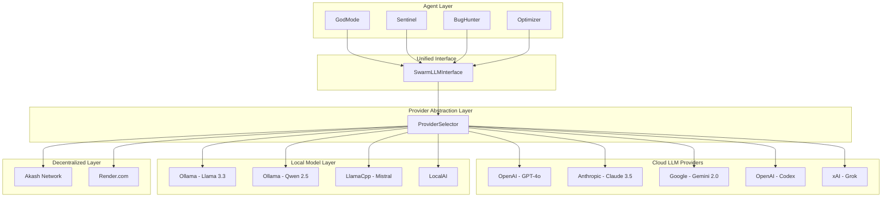
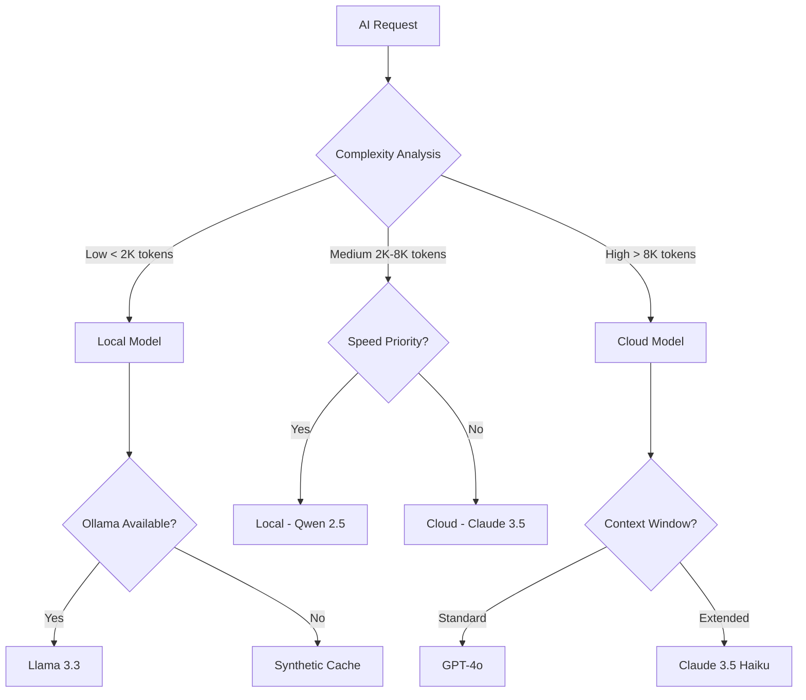
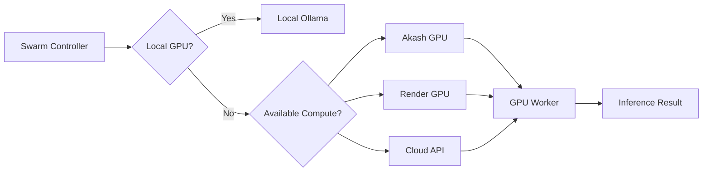

# Portable Swarm Architecture - Strategic Plan

## Executive Summary

This document outlines the architecture transformation required to make the AppForge Swarm:
- **LLM Agnostic** - Support for Claude, Gemini, Codex, Grok, and local models
- **SLM + LLM Strategy** - Local small models for agentic logic, cloud for high-level reasoning
- **IDE Extension Ready** - Private VSCode extension for personal use
- **Decentralized Compute Ready** - Akash/Render GPU integration
- **Self-Host Capable** - Recursive self-improvement for local-only operation

---

## Current Architecture Analysis

### Current LLM Provider Stack

```
┌─────────────────────────────────────────────────────────────┐
│                    Agent Layer                              │
│  (GodMode, Sentinel, BugHunter, etc.)                       │
└─────────────────────┬───────────────────────────────────────┘
                      │
                      ▼
┌─────────────────────────────────────────────────────────────┐
│              MultiLLMClient (llm.ts)                        │
│  ┌─────────────────┐ ┌─────────────────┐ ┌───────────────┐ │
│  │ SovereignModel   │ │ SovereignLLM    │ │ Antigravity   │ │
│  │ (Ollama)        │ │ (Synthetic)     │ │ (Base44 Relay)│ │
│  └─────────────────┘ └─────────────────┘ └───────────────┘ │
└─────────────────────┬───────────────────────────────────────┘
                      │
                      ▼
┌─────────────────────────────────────────────────────────────┐
│              Hardcoded OpenAI (loop.ts)                      │
│           process.env.OPENAI_API_KEY REQUIRED                │
└─────────────────────────────────────────────────────────────┘
```

### Identified Coupling Points

1. **[`loop.ts:21`](swarm/core/loop.ts:21)** - `process.env.OPENAI_API_KEY` hardcoded requirement
2. **[`llm.ts`](swarm/core/llm.ts)** - No unified provider interface
3. **[`sovereign_model.ts`](swarm/core/sovereign_model.ts)** - Basic Ollama integration, no model selection
4. **No provider abstraction** - Agents directly call LLM methods

---

## Target Architecture

### Layered Provider Architecture



---

## Implementation Plan

### Phase 1: LLM Provider Abstraction Layer

#### 1.1 Create Unified Provider Interface

**File:** [`swarm/core/providers/llm_provider_interface.ts`](swarm/core/providers/llm_provider_interface.ts)

```typescript
interface LLMProvider {
    name: string;
    type: 'cloud' | 'local' | 'decentralized';
    capabilities: string[];
    
    chat(request: AIRequest): Promise<AIResponse>;
    stream(request: AIRequest): AsyncIterable<AIResponse>;
    embeddings(text: string): Promise<number[]>;
    models(): Promise<ModelInfo[]>;
    health(): Promise<HealthStatus>;
}

interface AIRequest {
    system: string;
    user: string;
    model?: string;
    temperature?: number;
    maxTokens?: number;
    stream?: boolean;
}

interface AIResponse {
    id: string;
    content: string;
    usage: TokenUsage;
    model: string;
    provider: string;
}
```

#### 1.2 Create Provider Registry

**File:** [`swarm/core/providers/provider_registry.ts`](swarm/core/providers/provider_registry.ts)

```typescript
class ProviderRegistry {
    private providers: Map<string, LLMProvider> = new Map();
    private defaultProvider: string;
    private fallbackChain: string[];

    register(provider: LLMProvider): void;
    get(name: string): LLMProvider | undefined;
    select(request: AIRequest): LLMProvider;
    getHealth(): Map<string, HealthStatus>;
}
```

#### 1.3 Implement Cloud Providers

**Files to create:**
- [`swarm/core/providers/openai_provider.ts`](swarm/core/providers/openai_provider.ts)
- [`swarm/core/providers/anthropic_provider.ts`](swarm/core/providers/anthropic_provider.ts)
- [`swarm/core/providers/gemini_provider.ts`](swarm/core/providers/gemini_provider.ts)
- [`swarm/core/providers/codex_provider.ts`](swarm/core/providers/codex_provider.ts)
- [`swarm/core/providers/grok_provider.ts`](swarm/core/providers/grok_provider.ts)

#### 1.4 Refactor Existing Local Providers

**Files to update:**
- [`swarm/core/sovereign_model.ts`](swarm/core/sovereign_model.ts) → [`swarm/core/providers/ollama_provider.ts`](swarm/core/providers/ollama_provider.ts)
- [`swarm/core/sovereign_llm.ts`](swarm/core/sovereign_llm.ts) → [`swarm/core/providers/synthetic_provider.ts`](swarm/core/providers/synthetic_provider.ts)
- [`swarm/core/llm.ts`](swarm/core/llm.ts) → [`swarm/core/providers/multi_provider.ts`](swarm/core/providers/multi_provider.ts)

---

### Phase 2: Local Model Runner Enhancement

#### 2.1 Enhanced Ollama Provider

```typescript
class OllamaProvider implements LLMProvider {
    private baseUrl: string;
    private modelPool: ModelPool;
    private contextCache: ContextCache;

    async selectModel(request: AIRequest): Promise<string>;
    async streamChat(request: AIRequest): Promise<AsyncIterable>;
    async pullModel(modelName: string): Promise<void>;
    async listModels(): Promise<ModelInfo[]>;
}
```

#### 2.2 LlamaCpp Integration

**File:** [`swarm/core/providers/llamacpp_provider.ts`](swarm/core/providers/llamacpp_provider.ts)

```typescript
class LlamaCppProvider implements LLMProvider {
    private binaryPath: string;
    private models: Map<string, ModelHandle>;
    
    async loadModel(modelPath: string): Promise<void>;
    async inference(params: InferenceParams): Promise<InferenceResult>;
    async freeModel(modelName: string): Promise<void>;
}
```

#### 2.3 Model Selection Strategy



---

### Phase 3: VSCode Extension Structure

#### 3.1 Extension Manifest

**File:** [`vscode-extension/package.json`](vscode-extension/package.json)

```json
{
    "name": "appforge-swarm",
    "displayName": "AppForge Swarm",
    "version": "1.0.0",
    "publisher": "appforge",
    "engines": { "vscode": "^1.85.0" },
    "categories": ["Other", "Machine Learning"],
    "activationEvents": ["onStartupFinished"],
    "main": "./out/extension.js",
    "contributes": {
        "commands": [
            {
                "command": "appforge-swarm.start",
                "title": "Start Swarm"
            },
            {
                "command": "appforge-swarm.agent",
                "title": "Run Agent"
            }
        ],
        "configuration": {
            "title": "AppForge Swarm",
            "properties": {
                "appforge-swarm.llmProvider": {
                    "type": "string",
                    "enum": ["openai", "anthropic", "gemini", "ollama", "llamacpp"],
                    "default": "ollama"
                }
            }
        }
    }
}
```

#### 3.2 Extension Architecture

```
vscode-extension/
├── package.json
├── tsconfig.json
├── src/
│   ├── extension.ts          # Entry point
│   ├── api/
│   │   ├── swarmClient.ts    # Swarm API client
│   │   └── llmProvider.ts    # LLM config UI
│   ├── agents/
│   │   ├── codeAgent.ts      # Code generation
│   │   └── reviewAgent.ts    # Code review
│   └── webview/
│       ├── dashboard.ts      # Swarm dashboard
│       └── configPanel.ts    # Settings UI
└── out/                      # Compiled JS
```

---

### Phase 4: Decentralized Compute Integration

#### 4.1 Akash Network Integration

**File:** [`swarm/infrastructure/akash_provider.ts`](swarm/infrastructure/akash_provider.ts)

```typescript
class AkashProvider implements LLMProvider {
    private keystore: AkashKeystore;
    private deploymentManager: DeploymentManager;

    async deployGPUWorker(config: GPUConfig): Promise<Deployment>;
    async submitTask(task: InferenceTask): Promise<TaskResult>;
    async getStatus(): Promise<ClusterStatus>;
}
```

#### 4.2 Render.com Integration

**File:** [`swarm/infrastructure/render_provider.ts`](swarm/infrastructure/render_provider.ts)

```typescript
class RenderProvider implements LLMProvider {
    private apiClient: RenderAPIClient;
    private serviceManager: ServiceManager;

    async createService(spec: ServiceSpec): Promise<Service>;
    async scaleService(serviceId: string, replicas: number): Promise<void>;
    async getLogs(serviceId: string): Promise<string[]>;
}
```

#### 4.3 Compute Orchestration



---

### Phase 5: Self-Hosting Capabilities

#### 5.1 Docker Configuration

**File:** [`docker-compose.swarm.yml`](docker-compose.swarm.yml)

```yaml
version: '3.8'
services:
  swarm-core:
    build: ./docker/swarm-core
    environment:
      - LLM_PROVIDER=ollama
      - OLLAMA_HOST=ollama:11434
    depends_on:
      - ollama
    volumes:
      - swarm-data:/app/data

  ollama:
    image: ollama/ollama:latest
    volumes:
      - ollama-models:/root/.ollama
    ports:
      - "11434:11434"
    deploy:
      resources:
        reservations:
          devices:
            - driver: nvidia
              count: 1
              capabilities: [gpu]

  postgres:
    image: postgres:15
    environment:
      - POSTGRES_DB=swarm
    volumes:
      - postgres-data:/var/lib/postgresql/data

volumes:
  swarm-data:
  ollama-models:
  postgres-data:
```

#### 5.2 Kubernetes Configurations

**Directory:** [`kubernetes/`](kubernetes/)

```
kubernetes/
├── namespace.yaml
├── swarm-core-deployment.yaml
├── ollama-deployment.yaml
├── gpu-node-selector.yaml
├── ingress.yaml
└── configmaps/
    └── llm-config.yaml
```

#### 5.3 Self-Improvement Loop

```mermaid
flowchart TD
    A[Local Model Training] --> B{Evaluate Performance}
    B -->|Improved| C[Update Model Weights]
    B -->|Degraded| D[Rollback]
    C --> E[Push to Model Registry]
    E Swarm Update]
    F --> --> F[Notify A
    
    G[External Knowledge] --> H[Knowledge Distillation]
    H --> I[Fine-tune Local Model]
    I --> A
```

---

### Phase 6: Configuration Management

#### 6.1 Unified Config Schema

**File:** [`swarm/config/schema.ts`](swarm/config/schema.ts)

```typescript
interface SwarmConfig {
    llm: {
        providers: ProviderConfig[];
        defaultProvider: string;
        fallbackOrder: string[];
        localModelPath: string;
    };
    swarm: {
        mode: 'development' | 'production' | 'self-hosted';
        agents: AgentConfig[];
        coordination: CoordinationConfig;
    };
    compute: {
        type: 'local' | 'akash' | 'render' | 'hybrid';
        gpuRequired: boolean;
        resources: ResourceConfig;
    };
    ide: {
        enabled: boolean;
        port: number;
        authToken: string;
    };
}
```

#### 6.2 Environment Variables

```bash
# LLM Configuration
LLM_PROVIDER=multi                    # Provider selection strategy
OPENAI_API_KEY=sk-...                 # OpenAI (optional)
ANTHROPIC_API_KEY=sk-ant-...          # Claude (optional)
GOOGLE_API_KEY=AI...                  # Gemini (optional)
GROK_API_KEY=xai-...                  # Grok (optional)

# Local Model Configuration
OLLAMA_HOST=http://localhost:11434
OLLAMA_MODELS=llama3.3,qwen2.5
LLAMACPP_PATH=/models

# Decentralized Compute
AKASH_NETWORK=testnet
RENDER_API_KEY=ren_...

# IDE Extension
VSCODE_EXTENSION_PORT=3456
SWARM_API_TOKEN=...

# Self-Hosting
DEPLOYMENT_MODE=self-hosted
DOCKER_ENABLED=true
KUBERNETES_ENABLED=false
```

---

## File Structure - After Transformation

```
swarm/
├── core/
│   ├── providers/
│   │   ├── llm_provider_interface.ts   # Abstract base
│   │   ├── provider_registry.ts        # Provider manager
│   │   ├── openai_provider.ts         # GPT-4o
│   │   ├── anthropic_provider.ts      # Claude 3.5
│   │   ├── gemini_provider.ts         # Gemini 2.0
│   │   ├── codex_provider.ts          # Codex
│   │   ├── grok_provider.ts           # Grok
│   │   ├── ollama_provider.ts         # Ollama (enhanced)
│   │   ├── llamacpp_provider.ts       # LlamaCpp
│   │   └── synthetic_provider.ts      # Sovereign synthetic
│   ├── llm.ts                         # Legacy → delete after migration
│   └── loop.ts                        # Update to use provider registry
├── config/
│   ├── schema.ts                      # Config validation
│   ├── providers.yaml                # Provider configurations
│   └── swarm.yaml                     # Swarm configurations
├── infrastructure/
│   ├── akash_provider.ts             # Akash GPU
│   └── render_provider.ts           # Render GPU
├── ide/
│   └── vscode-extension/             # VSCode extension
├── scripts/
│   ├── setup-local-models.sh          # Ollama model downloader
│   └── deploy-akash.sh               # Akash deployment script
└── docker/
    ├── swarm-core/
    │   └── Dockerfile
    └── docker-compose.swarm.yml
```

---

## Migration Strategy

### Step 1: Extract Provider Interface
Create the abstraction layer without breaking existing code.

### Step 2: Implement Cloud Providers
Add Claude, Gemini, Codex, Grok alongside existing OpenAI.

### Step 3: Enhance Local Providers
Improve Ollama integration with model pooling and caching.

### Step 4: Update Agent Base Class
Refactor agents to use `ProviderRegistry` instead of direct LLM calls.

### Step 5: Remove Hardcoded Dependencies
Eliminate `OPENAI_API_KEY` requirement, make it optional.

### Step 6: Add IDE Extension
Create VSCode extension with swarm control panel.

### Step 7: Add Decentralized Compute
Integrate Akash and Render for GPU fallback.

### Step 8: Document Self-Hosting
Create guides for Docker and Kubernetes deployment.

---

## Priority Matrix

| Feature | Impact | Effort | Priority |
|---------|--------|--------|----------|
| Provider Interface | High | Medium | 1 |
| Claude Support | High | Low | 2 |
| Gemini Support | High | Low | 3 |
| Ollama Enhancement | High | Medium | 4 |
| Remove OpenAI Dependency | High | Low | 5 |
| VSCode Extension | Medium | High | 6 |
| Akash Integration | Medium | High | 7 |
| Render Integration | Medium | Medium | 8 |
| Self-Hosting Docs | Medium | Low | 9 |
| Synthetic Provider | Low | Medium | 10 |

---

## Success Criteria

1. **Provider Agnostic** - Swarm runs without any cloud API keys (local-only mode)
2. **Multi-Provider Fallback** - Automatic failover between providers
3. **Local First** - Prioritizes local models for cost and speed
4. **IDE Integration** - Full VSCode extension with swarm control
5. **Portable** - Can be deployed on any Docker/K8s environment
6. **Self-Improving** - Can fine-tune local models from swarm experience

---

## Risk Mitigation

| Risk | Mitigation |
|------|------------|
| Local model performance | Maintain cloud fallback with quality scoring |
| Provider API changes | Provider interface isolates changes |
| IDE extension complexity | Start with minimal viable product |
| Decentralized compute cost | Implement budget limits and monitoring |
| Self-hosting complexity | Provide pre-built Docker images |
