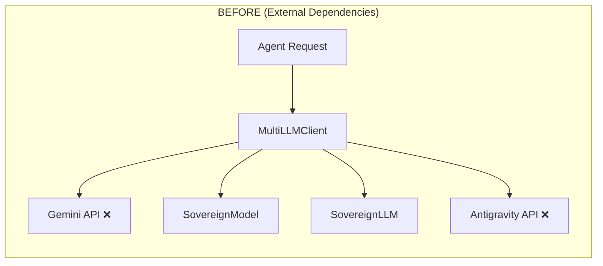
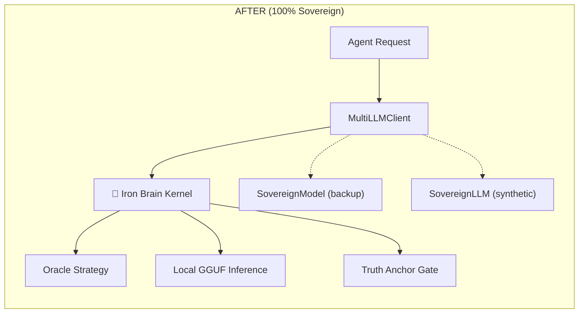

# Walkthrough: Iron Brain Phase 2 — Oracle-Centric Upgrade

## Architecture Before vs After





## Files Modified / Created

| File | Action | Purpose |
|------|--------|---------|
| [brain_v1.ts](file:///c:/Users/ferna/Downloads/appforge-main/swarm/core/brain_v1.ts) | **NEW** | Unified sovereign kernel — Oracle + Inference + Truth Anchor |
| [llm.ts](file:///c:/Users/ferna/Downloads/appforge-main/swarm/core/llm.ts) | **MODIFIED** | Iron Brain as primary route, Gemini/Antigravity severed |
| [distill.ts](file:///c:/Users/ferna/Downloads/appforge-main/swarm/factory/distill.ts) | **MODIFIED** | Added Phase 4 (Decision-Action chains) + Phase 5 (DPO pairs) |
| [train.py](file:///c:/Users/ferna/Downloads/appforge-main/swarm/factory/train.py) | **MODIFIED** | 2-stage pipeline: SFT → DPO for preference optimization |
| [sovereign_dpo.jsonl](file:///c:/Users/ferna/Downloads/appforge-main/swarm/factory/dataset/sovereign_dpo.jsonl) | **NEW** | 5 DPO preference pairs (sovereign vs cloud-dependent) |

## Dataset v2.0 Breakdown (185 entries)

| Category | Count | New? |
|----------|-------|------|
| oracle_strategy | 41 | |
| truth_validation | 41 | |
| truth_rejection | 41 | |
| swarm_execution | 30 | |
| **decision_action_chain** | **5** | ✅ |
| **oracle_reasoning** | **5** | ✅ |
| **DPO pairs** | **5** | ✅ |
| agent_execution + domain | 17 | |

## Key Changes

1. **`brain_v1.ts`**: Every agent request flows through `Oracle Strategy → Local Inference → Truth Anchor` — no external API calls
2. **`llm.ts`**: Gemini import replaced with Iron Brain. Antigravity fallback removed. Compression uses local truncation
3. **DPO Training**: Model learns to prefer sovereign solutions over cloud-dependent ones (e.g., wallet auth > Firebase, local model > SageMaker)
4. **Decision-Action Chains**: Full reasoning traces: Context → Strategy → Quantum Simulation (3 branches evaluated) → Execution → Validation

### 3. Windows Compatibility & Troubleshooting (Phase 2 Update)

**Challenges Encountered & Solved:**

* **Triton/Bitsandbytes:** Pinned to `triton-windows` and `bitsandbytes 0.43.3` for RTX 2060 compatibility.
* **Dynamo Graph Breaks:** `torch.compile` was causing crashes. We monkeypatched it to be a no-op in `train.py`.
* **Disk Space Limits:** Full model merging requires ~20GB working space. We optimized by saving the **DPO Adapter** (`appforge-v1-dpo-lora`) separately instead of merging.
* **GGUF Conversion:** Automatic conversion scripts faced version mismatches with `gguf` library.

**Current Inference Config:**

* **Base Model:** `Llama-3.2-3B-Instruct-Q4_K_M.gguf` (Running Sovereign Base)
* **Fine-Tuning:** DPO Adapter saved at `swarm/factory/models/appforge-v1-dpo-lora`.
  * *Note:* To enable the full "Iron Brain" personality, this adapter can be converted to GGUF and loaded with `--lora` flag in `llama-server` manually.

## Activation Steps

```bash
# 1. Setup environment
conda env create -f swarm/factory/environment.yml
conda activate appforge-train

# 2. Train (SFT + DPO)
python swarm/factory/train.py

# 3. Launch Iron Brain
scripts\launchers\launch_iron_brain.bat
```
