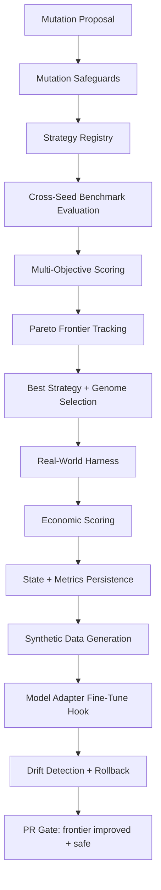

# Evolution Intelligence Architecture

## Key additions
- Multi-objective scoring + dominance checks.
- Deterministic cross-seed stability scoring.
- Real-world deterministic task harness.
- Economic optimization layer.
- Continuous training loop with checkpoint rollback on drift.
